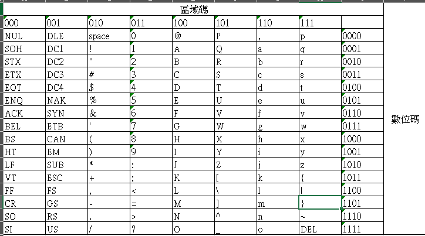

= 數位邏輯概論-chapter1
羅星傑 <alvin@e-mon.com.tw>
v1.0, {docdate}
:doctype: book
:experimental:
:icons: font
:sectnums:
:toc: left
:toc-title: 大綱
:toclevels: 2
:reproducible:
:hardbreaks-option:
:hide-uri-scheme:
:url-org: https://github.com/Alvin-Lo0729
:url-repo: {url-org}/effect-java
ifdef::env-site[:url-project: link:]
:url-rel-file-base: link:
ifdef::env-site,env-yard[]
:url-rel-file-base: {url-repo}/blob/master/
endif::[]
:stylesheet: ./doc/css/adoc-colony.css

== 編碼介紹

=== ASCII碼

ASCII (American Standard Code for Information Interchange) 是一種字符編碼標準，用於表示文本中的字符。它使用7位二進制數來表示128個字符，包括英文字母（大小寫）、數字、標點符號和一些控制字符。ASCII碼廣泛應用於計算機系統和通信協議中，是現代字符編碼的基礎。

每個ASCII都是由7個bit組成

image::../images/ascii.jpg[aa]

==== 區域
前面是描述區域ZONE的部分，佔3bit，期區域是代表類型的意思

==== 控制碼
000
001
010
---
以上的為控制碼，屬於控制游標上下左右....等

例如
000 0111 BELL
010 0000 Space
001 1011 ESC

==== 數字

011 為數字0~9的開頭

所以阿拉伯數字1為 011 0001 、 2為 011 0010 、8為 011 1000

==== 英文字母A~Z

100
101
---
以上的為英文字母A~Z的開頭

A為 100 0001 、 B為 100 0010 、 Z為 101 1010

==== 英文字母a~z
110
111
---
以上的為英文字母a~z的開頭

a為 110 0001 、 b為 110 0010 、 z為 111 1010

==== 數位
後面是數值區域Digital的部分，佔4bit，數值區域是代表其對照表數字的意思

==== ASCII碼對照表

如果要表示字母A，則為 100 0001
如果要表示數字1，則為 011 0001
如果要表示空白鍵，則為 010 0000

==== ASCII碼的轉換

當想表示字母A時 其二進至為 100 0001，則轉換16進制為 41，轉換10進制為 65

當享表示數字1時 其二進至為 011 0001，則轉換16進制為 31，轉換10進制為 49

