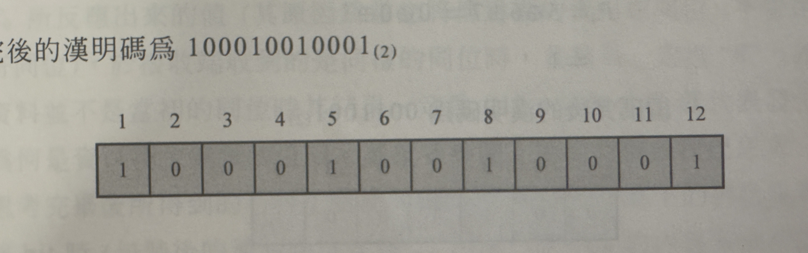

= 數位邏輯概論-chapter1
羅星傑 <alvin@e-mon.com.tw>
v1.0, {docdate}
:doctype: book
:experimental:
:icons: font
:sectnums:
:toc: left
:toc-title: 大綱
:toclevels: 4
:reproducible:
:hardbreaks-option:
:hide-uri-scheme:
:url-org: https://github.com/Alvin-Lo0729
:url-repo: {url-org}/Ncut-University-Night-School
ifdef::env-site[:url-project: link:]
:url-rel-file-base: link:
:url-rel-tree-base: link:
ifdef::env-site,env-yard[]
:url-rel-file-base: {url-repo}/blob/HEAD/
:url-rel-tree-base: {url-repo}/tree/HEAD/
endif::[]
:stylesheet: ./doc/css/adoc-colony.css

== 編碼介紹

=== ASCII碼

ASCII (American Standard Code for Information Interchange) 是一種字符編碼標準，用於表示文本中的字符。它使用7位二進制數來表示128個字符，包括英文字母（大小寫）、數字、標點符號和一些控制字符。ASCII碼廣泛應用於計算機系統和通信協議中，是現代字符編碼的基礎。

每個ASCII都是由7個bit組成

==== 區域
前面是描述區域ZONE的部分，佔3bit，期區域是代表類型的意思

==== 控制碼
000
001
010
---
以上的為控制碼，屬於控制游標上下左右....等

例如
000 0111 BELL
010 0000 Space
001 1011 ESC

==== 數字

011 為數字0~9的開頭

所以阿拉伯數字1為 011 0001 、 2為 011 0010 、8為 011 1000

==== 英文字母A~Z

100
101
---
以上的為英文字母A~Z的開頭

A為 100 0001 、 B為 100 0010 、 Z為 101 1010

==== 英文字母a~z
110
111
---
以上的為英文字母a~z的開頭

a為 110 0001 、 b為 110 0010 、 z為 111 1010

==== 數位
後面是數值區域Digital的部分，佔4bit，數值區域是代表其對照表數字的意思

==== ASCII碼對照表

image::../images/數位邏輯概論/ascii對照.jpg[dd]

如果要表示字母A，則為 100 0001
如果要表示數字1，則為 011 0001
如果要表示空白鍵，則為 010 0000

==== ASCII碼的轉換

當想表示字母A時 其二進至為 100 0001，則轉換16進制為 41，轉換10進制為 65

當享表示數字1時 其二進至為 011 0001，則轉換16進制為 31，轉換10進制為 49

=== 漢明碼

漢明碼（Hamming Code）是一種用於檢測和糾正數據傳輸或存儲過程中發生的錯誤的編碼技術。

==== 漢明碼計算方式

===== 取得漢明碼總位數

此計算方式為漢明碼編碼所需長度的計算方式，2^P >= M + P + 1

P = 檢查位元數
M = 資料位元數

如資料長度為8bit，則依照公式 2^P >= 8 + P + 1，則P需等於4，公式才會成立，所以漢明碼長度為2^4 = 16，檢查位元數量為4，資料位元數為8

===== 決定漢明碼同位位元的位置

依照上面的例子，檢查位元數量為4，其同位位元的位置須放在2的0到N-1次方的位置，以此為例

2^0 = 1
2^1 = 2
2^2 = 4
2^3 = 8

所以同位位元的位置為1、2、4、8

P為同位元資料位置與原本資料的位置

===== 決定同位位元資料內容

畫一個計算用的圖，將Hamming code的bit欄位由大到小排列，然後將bit數為1的欄位轉成二進制寫出來，原資料為01000001，所以將5、12取出做XOR，可參考以下圖表

最後完整的漢明碼為

image::../images/數位邏輯概論/漢明碼手寫步驟1.png[]

==== 漢明碼驗證與取得原資料方式
當收到一組漢明碼後，依照同位元的位置做XOR計算，若結果為0，則表示無錯誤，若結果不為0，則表示有錯誤，且結果的數字即為錯誤位元的位置

當取得的漢明碼內容為1100110，依照順序先將參數寫好

將bit為1的位置取出，並透由編碼公式取得同位元數量，且將參數寫上

以上圖可取得最後結果為000則表示資料無誤

若結果不為000，則表示有錯誤，且結果的數字即為錯誤位元的位置

最後依照取得的同位元位置，將其排除可得原始資料

==== 參考網址

https://yaojordan.medium.com/%E8%A8%88%E6%A6%82-hamming-code-%E6%BC%A2%E6%98%8E%E7%A2%BC-78102d680c78

https://dangerlover9403.pixnet.net/blog/post/202441998

